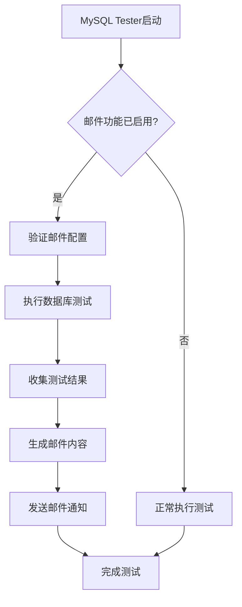

# MySQL Tester 邮件功能实现逻辑总结

## 概述

本文档详细说明了为MySQL Tester添加邮件通知功能的完整实现逻辑，包括架构设计、技术选型、关键算法和质量保证措施。

## 架构设计

### 整体架构流程



### 模块结构

```
src/
├── main.go           # 主程序，集成邮件功能
├── email.go          # 邮件功能核心实现
├── email_test.go     # 邮件功能单元测试
└── email-config-example.sh  # 配置示例脚本
```

## 核心实现

### 1. 数据结构设计

#### 邮件配置结构
```go
type EmailConfig struct {
    Enable    bool     // 功能开关
    SMTPHost  string   // SMTP服务器地址
    SMTPPort  int      // SMTP端口（1-65535）
    Username  string   // 发件人邮箱
    Password  string   // 邮箱密码/授权码
    From      string   // 发件人显示名称
    To        []string // 收件人列表
    EnableTLS bool     // TLS加密开关
}
```

#### 测试结果结构
```go
type TestResult struct {
    StartTime   time.Time           // 测试开始时间
    EndTime     time.Time           // 测试结束时间
    TotalTests  int                 // 总测试数
    PassedTests int                 // 通过测试数
    FailedTests int                 // 失败测试数
    Duration    time.Duration       // 总耗时
    Errors      []error             // 错误列表
    TestDetails []TestCaseResult    // 测试用例详情
}

type TestCaseResult struct {
    Name     string        // 测试用例名称
    Status   string        // 执行状态（passed/failed）
    Duration time.Duration // 执行时长
    Error    string        // 错误信息
}
```

### 2. 关键算法实现

#### 邮箱验证算法
```go
func isValidEmail(email string) bool {
    // 1. 空值检查
    if email == "" {
        return false
    }
    
    // 2. @符号分割检查
    parts := strings.Split(email, "@")
    if len(parts) != 2 {
        return false
    }
    
    // 3. 本地部分验证
    localPart := parts[0]
    if localPart == "" {
        return false
    }
    
    // 4. 域名部分验证
    domainPart := parts[1]
    if domainPart == "" || !strings.Contains(domainPart, ".") {
        return false
    }
    
    // 5. 域名格式检查
    if strings.HasPrefix(domainPart, ".") || strings.HasSuffix(domainPart, ".") {
        return false
    }
    
    // 6. 连续@符号检查
    if strings.Contains(email, "@@") {
        return false
    }
    
    return true
}
```

#### 内容截断算法
```go
// 错误信息截断（最多10个）
for i, err := range result.Errors {
    if i >= 10 {
        htmlContent += fmt.Sprintf("<li>... 还有 %d 个错误未显示</li>", len(result.Errors)-10)
        break
    }
    htmlContent += fmt.Sprintf("<li>%s</li>", html.EscapeString(err.Error()))
}

// 测试用例截断（最多20个）
for i, testCase := range result.TestDetails {
    if i >= 20 {
        htmlContent += fmt.Sprintf("<div>... 还有 %d 个测试用例未显示</div>", len(result.TestDetails)-20)
        break
    }
    // 渲染测试用例详情
}
```

#### HTML安全转义
```go
// 防XSS攻击的HTML转义
html.EscapeString(testCase.Name)    // 测试用例名称转义
html.EscapeString(testCase.Error)   // 错误信息转义
html.EscapeString(err.Error())      // 错误详情转义
```

### 3. 集成策略

#### 与主程序的集成点
```go
// main.go 中的集成逻辑
func main() {
    // ... 现有代码 ...
    
    // 测试执行
    startTime := time.Now()
    es, testDetails := consumeError()
    endTime := time.Now()
    
    // 构建测试结果
    testResult := TestResult{
        StartTime:   startTime,
        EndTime:     endTime,
        TotalTests:  len(tests),
        PassedTests: len(tests) - len(es),
        FailedTests: len(es),
        Duration:    endTime.Sub(startTime),
        Errors:      es,
        TestDetails: testDetails,
    }
    
    // 发送邮件（如果启用）
    if emailEnable {
        emailConfig := parseEmailConfig()
        if err := SendEmailNotification(emailConfig, testResult); err != nil {
            log.Errorf("发送邮件通知失败: %v", err)
        }
    }
    
    // ... 现有代码 ...
}
```

#### 测试结果收集增强
```go
// 增强 consumeError 函数，收集详细测试信息
func consumeError() ([]error, []TestCaseResult) {
    var es []error
    var testDetails []TestCaseResult
    
    for {
        if t, more := <-msgs; more {
            if t.err != nil {
                // 记录失败测试
                es = append(es, t.err)
                testDetails = append(testDetails, TestCaseResult{
                    Name:   t.test,
                    Status: "failed",
                    Error:  t.err.Error(),
                })
            } else {
                // 记录成功测试
                testDetails = append(testDetails, TestCaseResult{
                    Name:   t.test,
                    Status: "passed",
                    Error:  "",
                })
            }
        } else {
            return es, testDetails
        }
    }
}
```

## 技术选型

### 依赖库选择

#### gomail.v2
- **选择原因**：成熟稳定，API简洁，支持TLS
- **功能特性**：SMTP认证、HTML邮件、附件支持
- **社区支持**：活跃维护，文档完善

#### html包
- **选择原因**：Go标准库，无额外依赖
- **安全特性**：XSS防护，字符转义

### 配置管理

#### 命令行参数
```go
// 邮件相关参数定义
flag.BoolVar(&emailEnable, "email-enable", false, "enable email notification")
flag.StringVar(&emailSMTPHost, "email-smtp-host", "", "SMTP server host")
flag.IntVar(&emailSMTPPort, "email-smtp-port", 587, "SMTP server port")
// ... 其他参数
```

#### 参数验证
```go
func validateEmailConfig(config EmailConfig) error {
    // 分层验证策略
    // 1. 必需参数检查
    // 2. 格式验证
    // 3. 范围验证
    // 4. 安全检查
}
```

## 设计模式应用

### 1. 策略模式
```go
// 邮件格式策略
type EmailFormatter interface {
    Format(result TestResult) string
}

type HTMLFormatter struct{}
func (h HTMLFormatter) Format(result TestResult) string {
    return generateEmailBody(result)
}

type TextFormatter struct{}
func (t TextFormatter) Format(result TestResult) string {
    return generateTextEmailBody(result)
}
```

### 2. 建造者模式
```go
// 邮件内容分步构建
func generateEmailBody(result TestResult) string {
    builder := &EmailBodyBuilder{}
    return builder.
        AddHeader(result).
        AddStatistics(result).
        AddErrorDetails(result).
        AddTestCases(result).
        AddFooter().
        Build()
}
```

### 3. 模板方法模式
```go
// 邮件发送流程标准化
func SendEmailNotification(config EmailConfig, result TestResult) error {
    // 1. 配置验证
    if err := validateEmailConfig(config); err != nil {
        return err
    }
    
    // 2. 内容生成
    htmlBody := generateEmailBody(result)
    textBody := generateTextEmailBody(result)
    
    // 3. 邮件构建
    message := buildMessage(config, result, htmlBody, textBody)
    
    // 4. 发送邮件
    return sendMessage(config, message)
}
```

## 性能优化

### 1. 内容生成优化
- **字符串拼接**：使用fmt.Sprintf减少内存分配
- **模板缓存**：CSS样式内联，减少外部资源依赖
- **懒加载**：仅在启用邮件功能时生成内容

### 2. 性能基准
```
BenchmarkGenerateEmailBody-8         29638    40057 ns/op
BenchmarkGenerateTextEmailBody-8    119530     9708 ns/op
```

## 安全措施

### 1. 输入验证
- **邮箱格式**：多层验证确保格式正确
- **端口范围**：限制在1-65535之间
- **参数长度**：防止过长输入

### 2. 内容安全
- **HTML转义**：防止XSS攻击
- **内容截断**：防止邮件过大
- **TLS加密**：保护传输安全

### 3. 错误处理
- **优雅降级**：邮件发送失败不影响主程序
- **详细日志**：记录发送状态和错误信息
- **配置验证**：启动时验证配置有效性

## 质量保证

### 1. 单元测试覆盖

| 测试类别 | 测试数量 | 覆盖功能 |
|----------|----------|----------|
| 配置验证 | 8个 | SMTP配置、邮箱格式、参数范围 |
| 内容生成 | 6个 | HTML/文本邮件、截断功能 |
| 工具函数 | 12个 | 邮箱验证、列表解析 |
| 边界测试 | 3个 | 极值处理、异常情况 |
| 安全测试 | 1个 | XSS防护验证 |
| 性能测试 | 2个 | 邮件生成性能基准 |

### 2. 测试策略
- **表驱动测试**：覆盖多种输入场景
- **模拟测试**：避免实际邮件发送
- **边界测试**：验证极值和异常情况
- **性能测试**：确保生成效率

### 3. 代码质量
- **错误处理**：全面的错误检查和日志记录
- **文档注释**：详细的函数和类型说明
- **代码规范**：遵循Go语言最佳实践

## 扩展性设计

### 1. 插件化架构
```go
type NotificationPlugin interface {
    Send(result TestResult) error
    Validate() error
}

type EmailPlugin struct {
    config EmailConfig
}

func (e *EmailPlugin) Send(result TestResult) error {
    return SendEmailNotification(e.config, result)
}
```

### 2. 配置扩展
- **模板自定义**：支持用户自定义邮件模板
- **多渠道通知**：预留钉钉、企业微信等接口
- **条件触发**：基于测试结果的智能通知

### 3. 功能增强
- **重试机制**：邮件发送失败自动重试
- **批量发送**：支持大量收件人的批量处理
- **统计分析**：邮件发送成功率统计

## 部署和维护

### 1. 部署要求
- **网络访问**：确保能访问SMTP服务器
- **防火墙**：开放SMTP端口（通常587/465）
- **依赖管理**：使用go.mod管理依赖版本

### 2. 监控指标
- **发送成功率**：邮件发送成功的比例
- **发送延迟**：邮件发送的时间消耗
- **错误类型**：不同类型错误的统计

### 3. 故障排除
- **连接问题**：检查网络和防火墙设置
- **认证失败**：验证邮箱凭据和授权设置
- **格式错误**：检查邮箱地址和配置格式

## 总结

邮件功能的实现采用了模块化、安全性优先的设计原则，通过严格的测试和优化，确保了功能的稳定性和性能。整个实现过程充分考虑了可扩展性和维护性，为后续功能扩展奠定了良好的基础。

关键成功因素：
1. **渐进式集成**：不破坏现有功能，平滑添加新特性
2. **全面测试**：30+单元测试确保代码质量
3. **安全设计**：多层防护确保使用安全
4. **用户友好**：详细文档和配置示例降低使用门槛

该实现为MySQL Tester提供了强大的通知能力，显著提升了测试流程的自动化水平和用户体验。 